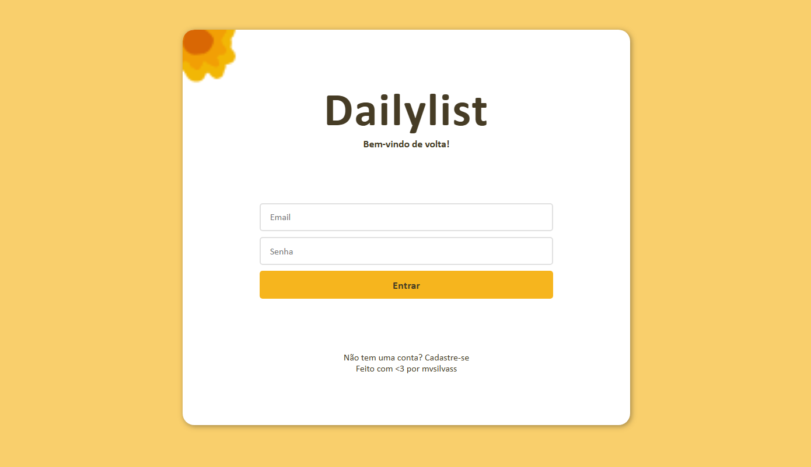
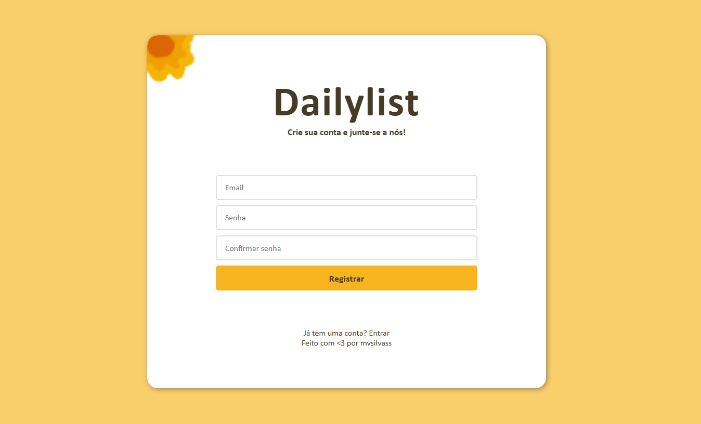
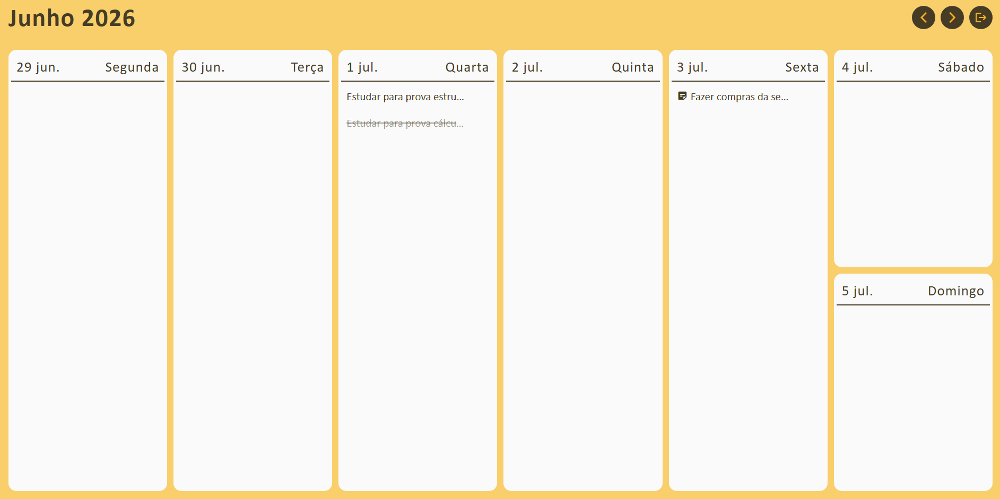
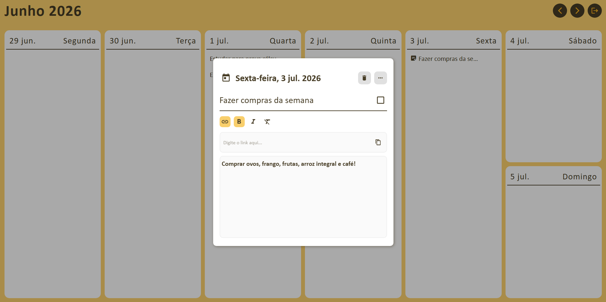

# DailyList

O DailyList é uma aplicação fullstack para gerenciamento de tarefas diárias, desenvolvida como projeto pessoal de conclusão e integração das formações de Spring Boot e Angular da Udemy. 

> **Stack:** Angular · Spring Boot · PostgreSQL · Docker · Cypress

## Tecnologias

### Backend
* **Linguagem & Framework:** Java 17 / Spring Boot 3
* **Segurança & Autenticação:** Spring Security 6, OAuth2 Resource Server  e BCrypt
* **Banco de Dados & Persistência:** PostgreSQL, Spring Data JPA e Hibernate

### Frontend
* **Framework:** Angular 17+ e TypeScript
* **Gerenciamento de Estado:** Angular Signals
* **Interface & UX:** Angular Material

### Infraestrutura & Qualidade
* **Containers:** Docker e Docker Compose
* **Testes Automatizados:** Cypress (Testes End-to-End)

##  Arquitetura

```
dailylist/
├── frontend/    # Angular
├── backend/     # Spring Boot
└── docker-compose.yml
```

Dois serviços isolados em rede Docker. O frontend consome a API REST do backend via HTTP. O banco de dados é acessível apenas pelo backend na rede `backend-network`.

```
[ Browser ] ──► [ frontend :4200 ] ──► [ backend :8080 ] ──► [ postgres :5432 ]
                  frontend-network         backend-network
```

## Frontend

### `/auth/login`
> 

---

### `/auth/register`
> 

---

### `/tasks`
> 
---
> 

---

## API — Endpoints

> Base URL: `http://localhost:8080`

### Autenticação

**POST `/auth/login`**
```json
// Request
{ "email": "usuario@example.com", "password": "senha123" }

// Response 200
{ "accessToken": "eyJhbGci...", "expiresIn": 3000 }
```

**POST `/auth/register`**
```json
// Request
{ "email": "novo@example.com", "password": "senha123" }

// Response 200
{ "message": "Usuário cadastrado com sucesso" }
```

### Fluxo de autenticação

```
POST /auth/login  { email, password }
        │
        ▼
AuthenticationManager → valida BCrypt
        │
        ▼
JWT gerado com chave RSA privada
  subject  : userId
  scope    : roles do usuário  ("BASIC" ou "ADMIN")
  expira   : 3000 segundos (~50 min)
        │
        ▼
{ accessToken, expiresIn }  →  cliente
```

A partir do login, todos os endpoints de `/tasks/**` passam a exigir o token no cabeçalho da requisição: `Authorization: Bearer <token>`

| Método | Rota | Descrição |
|---|---|---|
| `GET` | `/tasks` | Listar tarefas do usuário |
| `POST` | `/tasks` | Criar tarefa |
| `GET` | `/tasks/{id}` | Buscar tarefa por ID |
| `PUT` | `/tasks/{id}` | Atualizar tarefa |
| `DELETE` | `/tasks/{id}` | Excluir tarefa |
| `PUT` | `/tasks/reorder` | Reordenar tarefas |

**POST/PUT `/tasks`**
```json
{
  "title": "Estudar para prova de cálculo II",   // obrigatório
  "description": "Ver documentação",             // opcional
  "link": "https://docs.docker.com",             // opcional
  "targetDate": "2025-12-31",                    // obrigatório
  "priority": 1,
  "isDone": false
}
```

## Configuração

### Pré-requisitos

- Docker e Docker Compose

### 1. Clone o repositório

```bash
git clone https://github.com/mvsilvass/dailylist
cd dailylist
```

### 2. Configure as variáveis de ambiente

Copie o arquivo de exemplo e preencha os valores:

```bash
# Linux/Mac
cp .env.example .env

# Windows
copy .env.example .env
```

### 3. Suba os serviços

```bash
docker compose up --build
```

### Com os serviços rodando, **é só abrir o navegador e usar!** Acesse a interface em: `http://localhost:4200`

## Licença

Este projeto está licenciado sob a [MIT License](LICENSE). Veja o arquivo [LICENSE](LICENSE) para mais detalhes.